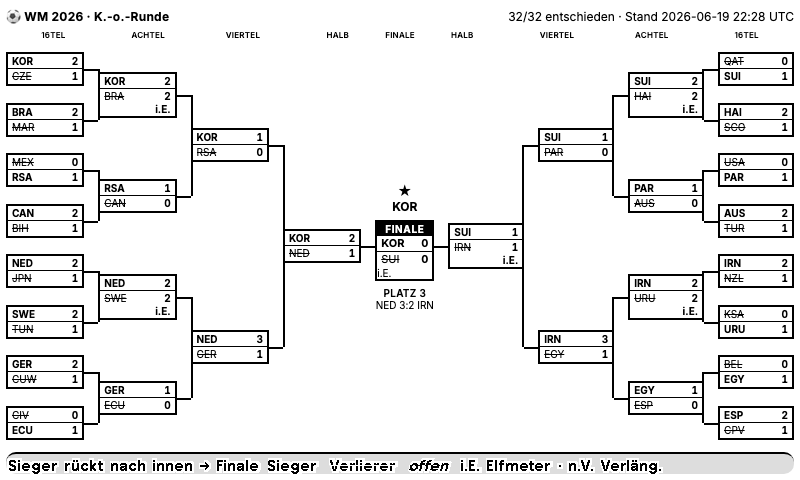
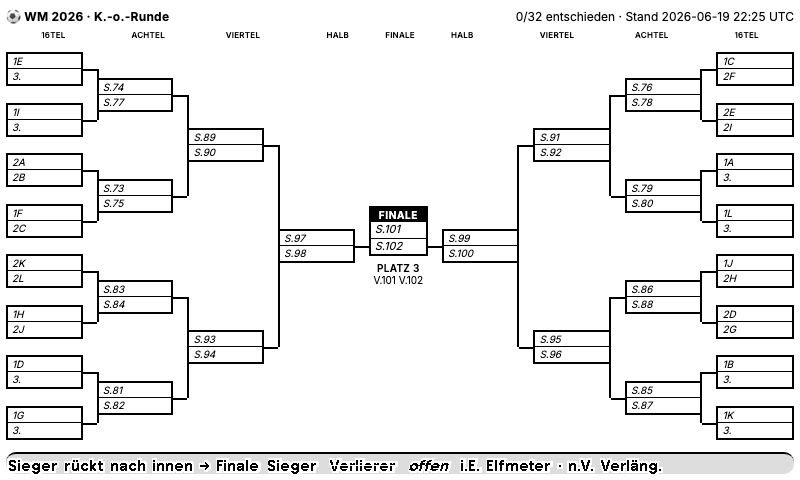
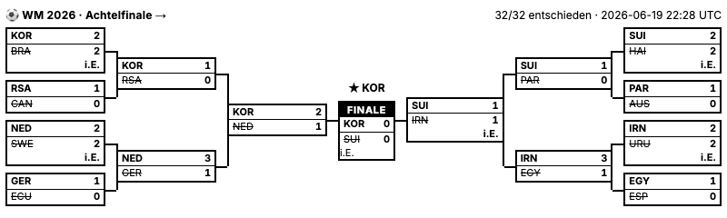
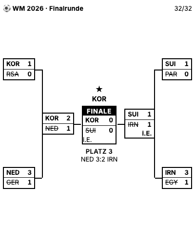
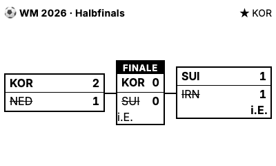

# TRMNL Private Plugin — FIFA WM 2026 K.-o.-Baum

Zeigt den **kompletten K.-o.-Baum der FIFA WM 2026** auf TRMNL OG und
**TRMNL X** — als klassischen Turnierbaum, der **in der Mitte zusammenläuft**:
linke Hälfte und rechte Hälfte laufen aufeinander zu, das **Finale steht zentral**.

```
Sechzehntel · Achtel · Viertel · Halb │ FINALE │ Halb · Viertel · Achtel · Sechzehntel
```

* **Sieger** = fett, **Verlierer** = ~~durchgestrichen~~, **noch offen** = _kursiver Platzhalter_.
* Elfmeterschießen wird mit **`i.E.`** gekennzeichnet, Verlängerung mit **`n.V.`**.
* Funktioniert **schon vor Beginn der K.-o.-Phase** (alles Platzhalter wie `1E`, `2A`,
  `S.74` = „Sieger Spiel 74") und **füllt sich automatisch**, sobald Gruppen
  abgeschlossen sind und K.-o.-Ergebnisse eintreffen.

| gefüllt (Beispiel) | vor der K.-o.-Phase (live) |
|---|---|
|  |  |

---

## 1. Datenquelle (verifiziert)

**Primär: `openfootball/worldcup.json`** (GitHub, raw JSON, **kein API‑Key**).

| Datei | URL |
|---|---|
| Spiele/Ergebnisse | `https://raw.githubusercontent.com/openfootball/worldcup.json/master/2026/worldcup.json` |
| Teams + Flaggen/Codes | `https://raw.githubusercontent.com/openfootball/worldcup.json/master/2026/worldcup.teams.json` |

### Verifizierter Feld‑Mapping (echter Testabruf am 2026‑06‑19)

`worldcup.json` → `{ "name": "World Cup 2026", "matches": [ … ] }`, **104 Matches**
(72 Gruppenspiele + **32 K.-o.-Spiele**). Ein **K.-o.-Match**:

```json
{
  "num": 89, "round": "Round of 16", "date": "2026-07-04",
  "team1": "W74", "team2": "W77",
  "score": { "ft": [int, int], "et": [int, int], "pen": [int, int] }
}
```

Die K.-o.-Felder im Detail (das ist der Kern dieses Plugins):

| Feld | Bedeutung | Beispiel |
|---|---|---|
| `num` | eindeutige Spielnummer 73–104 | `89` |
| `round` | Runde (siehe Tabelle unten) | `"Round of 16"` |
| `team1` / `team2` | **Paarung – oft noch ein Platzhalter** | `"W74"`, `"1E"`, `"3A/B/C/D/F"` |
| `score.ft` | Ergebnis nach 90 min | `[1, 1]` |
| `score.et` | nach Verlängerung (optional) | `[2, 1]` |
| `score.pen` | Elfmeterschießen (optional) | `[4, 2]` |

**Runden‑Labels** (`round`) und ihre Zuordnung:

| `round` (Quelle) | Spiele | interner Key | Anzeige |
|---|---|---|---|
| `Round of 32` | 16 | `r32` | Sechzehntelfinale |
| `Round of 16` | 8 | `r16` | Achtelfinale |
| `Quarter-final` | 4 | `qf` | Viertelfinale |
| `Semi-final` | 2 | `sf` | Halbfinale |
| `Match for third place` | 1 | `third` | Spiel um Platz 3 |
| `Final` | 1 | `final` | Finale |

**Platzhalter‑Syntax** (so kodiert openfootball die noch offenen Paarungen):

| Muster | Bedeutung | aufgelöst, sobald … | sonst angezeigt als |
|---|---|---|---|
| `1A` / `2B` | Gruppensieger / ‑zweiter | der konkrete Platz mathematisch sicher ist | `1A` / `2B` |
| `3A/B/C/D/F` | einer der 8 besten Gruppendritten | die Quelle den echten Teamnamen einträgt | `3.` |
| `W74` | **Sieger** von Spiel 74 | Spiel 74 entschieden ist | `S.74` |
| `L101` | **Verlierer** von Spiel 101 | Spiel 101 entschieden ist | `V.101` |
| `Mexico` | echter Teamname (bereits gesetzt) | — | Team‑Code `MEX` |

`worldcup.teams.json` → 48 Teams mit `name`, `fifa_code` (z. B. `MEX`),
`flag_icon` (🇲🇽), `group`. Beim Abruf am 2026‑06‑19 waren **0/32 K.-o.-Spiele**
gespielt – alle Paarungen also noch Platzhalter (siehe rechtes Bild oben).

### Alternative für minutengenaue Live‑Stände: API‑Football

`https://v3.football.api-sports.io` (kostenloser Key), `league=1` (FIFA World Cup),
`season=2026`:

```
GET /fixtures?league=1&season=2026&round=Round of 16   # K.-o.-Einzelspiele
```

Liefert fertige Paarungen/Resultate inkl. Elfmeter (`fixture.status`, `score.penalty`).
Das Mapping müsste an die API‑Football‑Struktur angepasst werden
(`response[].teams`, `response[].score`); die Baum‑Topologie‑Logik dieses Repos
bleibt identisch.

---

## 2. Bracket‑Datenmodell

Implementiert in `src/bracket.py` (reine Funktionen, getestet).

**Topologie wird nicht hartkodiert**, sondern bei jedem Lauf rekonstruiert: vom
**Finale (Spiel 104)** aus werden die `W…`/`L…`‑Referenzen rückwärts verfolgt.
`team1` speist immer die **obere**, `team2` die **untere** Baumhälfte – ein
Post‑Order‑Durchlauf liefert die Spiele jeder Runde damit bereits **von oben nach
unten sortiert**, genau wie es das „in der Mitte zusammenlaufende" Layout braucht.

* **Linke Hälfte** = Teilbaum unter `Final.team1` (→ Halbfinale 101)
* **Rechte Hälfte** = Teilbaum unter `Final.team2` (→ Halbfinale 102)

**Sieger‑Ermittlung** (`outcome`): zuerst `ft`, bei Gleichstand `et`
(→ `n.V.`), dann `pen` (→ `i.E.`). Ein Unentschieden ohne `et`/`pen` gilt als
**noch nicht entschieden** (robust gegen unvollständige Daten).

**Gruppen‑Platzhalter** (`1A`/`2A`) werden über das getestete
Gruppen‑Tabellenmodul (`src/standings.py`) aufgelöst. Ein Platz wird bereits vor
dem letzten Gruppenspiel eingesetzt, sobald er unter allen verbleibenden
Sieg/Remis/Niederlage-Szenarien feststeht. Der direkte Vergleich der punktgleichen
Teams wird dabei vor Gesamttordifferenz und Gesamttoren berücksichtigt. Nicht
eindeutig feststehende Plätze bleiben als Platzhalter sichtbar.

Ausgabe‑Payload (Top‑Level‑Keys = Liquid‑Merge‑Variablen):

```json
{
  "updated_at": "2026-07-05 21:30 UTC",
  "tournament": "World Cup 2026",
  "ko_played": 5, "ko_total": 32,
  "champion": null,
  "left":  { "r32": [ …8 ], "r16": [ …4 ], "qf": [ …2 ], "sf": [ …1 ] },
  "right": { "r32": [ …8 ], "r16": [ …4 ], "qf": [ …2 ], "sf": [ …1 ] },
  "final": { …match }, "third": { …match }
}
```

Ein **Match** im Payload:

```json
{
  "num": 89, "round": "r16", "decided": true, "note": "i.E.", "score_str": "1:1 i.E.",
  "t1": { "code": "BRA", "flag": "🇧🇷", "name": "Brazil", "score": 1,
          "winner": true, "loser": false, "resolved": true, "placeholder": "W74" },
  "t2": { "code": "MEX", "flag": "🇲🇽", "name": "Mexico", "score": 1,
          "winner": false, "loser": true, "resolved": true, "placeholder": "W77" }
}
```

---

## 3. Layouts

Alle vier TRMNL‑Layouts liegen in `markup/` und sind **reines Standard‑Liquid**
(lokal wie auf TRMNL identisch renderbar). Mit zunehmender Verkleinerung wird der
Baum sinnvoll **von außen nach innen reduziert**:

| Datei | TRMNL-View | Inhalt |
|---|---|---|
| `full.liquid` | Full | **kompletter Baum** ab Sechzehntelfinale (9 Spalten) |
| `half_horizontal.liquid` | Half Horizontal | ab **Achtelfinale** (R16 → Finale → R16) |
| `half_vertical.liquid` | Half Vertical | **späte Runden** (Viertelfinale → Finale), inkl. Platz 3 |
| `quadrant.liquid` | Quadrant | **Final Four** (beide Halbfinals + Finale) |
| `shard.liquid` | — | gemeinsames CSS (→ TRMNL „Shared Markup") |

| half_horizontal | half_vertical | quadrant |
|---|---|---|
|  |  |  |

**Connector‑Linien:** Jede Runde ist eine gleich hohe Flex‑Spalte, jedes Spiel
ein gleich hoher Flex‑Slot. Bei perfektem 8→4→2→1‑Fan‑in sitzt jedes Folgespiel
exakt auf der Mitte seiner zwei Zubringer – die Verbindungslinien
(horizontaler Stummel je Spiel + vertikale Linie über 25–75 % des Slots) treffen
sich daher **bei jeder Größe pixelgenau**, ohne hartkodierte Koordinaten.

**Design:** „Turnierbaum‑Anzeigetafel" — schwarze Linien/Kopfzeilen, kräftige
Inter‑Sans, **keine** offiziellen FIFA‑/WM‑Logos. Teams über den
**FIFA‑3‑Buchstaben‑Code** (auf 1‑bit‑E‑Ink zuverlässiger als Farb‑Emoji; die
Emoji‑Flagge liegt im Payload unter `flag` bereit). Hervorhebung **nur** über
Fettung und solide schwarze Linien (Durchstreichen) – **kein Verlass auf
Graustufen**.

### TRMNL-X-Kompatibilität

Auf `trmnl.com` stellt die Plattform `Screen` und `View` passend zum Zielgerät
bereit. Die Plugin-Dateien enthalten deshalb die vorgeschriebene
`Layout`-Ebene und darunter einen isolierten Plugin-Canvas:

```text
Screen (TRMNL) → View (TRMNL) → Layout → KO-Canvas (dieses Plugin)
```

Es gibt im Plugin keine eigene `.screen`/`.view`, keine Viewport-Maße, keine
Transforms und kein `position: fixed`. Größen innerhalb des Baums verwenden
Container-Query-Units (`cqw`) im inneren Canvas relativ zum tatsächlichen
Layout-Slot. Die Framework-Klasse `layout--col` verhindert, dass TRMNL Header,
Baum und Footer als horizontale Reihe anordnet. Damit bleibt dasselbe Markup
auf dem 800×480 OG, dem logischen 1040×780-Canvas des TRMNL X und in
Mashup-Slots konsistent.

---

## 4. Lokal bauen & rendern

```bash
make setup            # venv + python-liquid

# Bracket berechnen → output/trmnl_data.json
make build            # live von openfootball
make build-offline    # aus den zwischengespeicherten data/-Dateien

# „durchgespielten" Baum demonstrieren (Champion, i.E., n.V.)
make simulate

# Vorschau aller 4 Layouts (HTML, je in echter Gerätegröße)
make preview            # HTML für TRMNL X sowie Full zusätzlich für OG
make preview-png      # zusätzlich PNGs via Google Chrome (headless)

make test             # 32 Logik-Checks (src/bracket.py)
```

`build_data.py`‑Optionen: `--matches/--teams` (Pfad oder URL),
`--simulate data/simulate_full.json` (Ergebnis‑Overlay zum Testen),
`--out PFAD`, `--webhook URL`.

Das **Simulations‑Overlay** (`data/simulate_full.json`) legt Resultate per
Spielnummer über die Rohdaten – praktisch, um das gefüllte Layout zu prüfen,
bevor echte K.-o.-Spiele stattfinden:

```json
{ "73": { "team1": "Croatia", "team2": "Brazil", "ft": [1, 2] },
  "104": { "ft": [1, 1], "pen": [4, 3] } }
```

---

## 5. TRMNL‑Einrichtung

TRMNL kann die Daten **nicht** direkt von openfootball ziehen (dort gibt es nur
Rohergebnisse, keinen fertigen Baum). `build_data.py` erzeugt den fertigen Payload,
TRMNL holt diesen per **Polling** ab.

### A) Polling (empfohlen)

1. `build_data.py` regelmäßig laufen lassen und `output/trmnl_data.json` unter
   einer **öffentlichen URL** bereitstellen (GitHub Pages / Gist‑Raw / S3 …).
   Beispiel GitHub Actions (alle 30 min):

   ```yaml
   # .github/workflows/build.yml
   on:
     schedule: [{ cron: "*/30 * * * *" }]
     workflow_dispatch:
   jobs:
     build:
       runs-on: ubuntu-latest
       steps:
         - uses: actions/checkout@v4
         - uses: actions/setup-python@v5
           with: { python-version: "3.12" }
         - run: pip install -r requirements.txt
         - run: python src/build_data.py --out docs/trmnl_data.json
         - uses: stefanzweifel/git-auto-commit-action@v5   # commit docs/ → Pages
   ```

2. TRMNL: **Plugins → Private Plugin → New**.
3. **Strategy: `Polling`**, **Polling URL** = die öffentliche JSON‑URL.
4. **Markup‑Felder** befüllen:
   * **Shared Markup** ← `markup/shard.liquid`
   * **Full** ← `markup/full.liquid`
   * **Half Horizontal** ← `markup/half_horizontal.liquid`
   * **Half Vertical** ← `markup/half_vertical.liquid`
   * **Quadrant** ← `markup/quadrant.liquid`
5. Speichern → Live‑Preview prüfen → Plugin einer Playlist zuweisen.

Wichtig: In die TRMNL-Markup-Felder nur den Inhalt der jeweiligen Liquid-Datei
kopieren. Keine zusätzliche `.screen`- oder `.view`-Hülle ergänzen; diese wird
von der Plattform anhand des gewählten Gerätemodells erzeugt.

Die Top‑Level‑Keys des Polling‑Response (`left`, `right`, `final`, `third`,
`champion`, `ko_played`, `updated_at` …) stehen im Liquid direkt als `{{ … }}` /
`` zur Verfügung.

### B) Webhook (Alternative)

`build_data.py --webhook https://trmnl.com/api/custom_plugins/<uuid>` schickt den
Payload als `{"merge_variables": …}` per POST. **Achtung:** Der volle Baum‑Payload
ist ~12 KB; das **Webhook‑Limit liegt bei 2 KB (TRMNL+: 5 KB)**. Für den ganzen
Baum ist daher **Polling** die richtige Strategie; der Webhook eignet sich nur
für eine stark reduzierte Variante (z. B. nur die Final Four).

### Refresh‑Intervall

K.-o.-Spiele ändern sich nur während laufender Partien. openfootball ist
community‑gepflegt (nicht sekundengenau) – ein **Refresh von 30–60 Minuten** ist
sinnvoll und schont Batterie/Rate‑Limits; während Spielphasen ggf. 15 min.
(TRMNL‑Webhook erlaubt max. 12 Pushes/h, TRMNL+ 30/h.)

---

## 6. Projektstruktur

```
backup/                 datierte Snapshots früherer Plugin-Stände
src/bracket.py         K.-o.-Modell: Topologie, Platzhalter-Auflösung, Sieger (pure, getestet)
src/standings.py       Gruppen-Tabellen (wiederverwendet zur 1X/2X-Auflösung)
src/build_data.py      Fetch → Bracket → output/trmnl_data.json (+ --simulate / --webhook)
src/render_preview.py  rendert die Liquid-Layouts lokal nach preview/*.html (+ --png)
markup/*.liquid        die 4 Layouts + shared.liquid (für TRMNL)
tests/test_bracket.py  32 Logik-Checks (outcome, Auflösung, Topologie, Assembly)
data/                  zwischengespeicherte openfootball-Rohdaten + Simulations-Overlay
output/trmnl_data.json fertiger Polling-/Webhook-Payload
preview/*.png|html     lokale Render-Vorschau (*_pre = aktueller Platzhalter-Stand)
```

Der Stand vor dem TRMNL-X-Strukturumbau vom 22. Juni 2026 liegt vollständig in
`backup/2026-06-22_13-24-19/`.

## 7. Bekannte Grenzen

* **Beste Gruppendritte** (`3A/B/C/D/F`): welche Gruppe in welches Sechzehntelfinale
  kommt, regelt eine FIFA‑Zuordnungstabelle, die erst nach der Gruppenphase feststeht.
  Bis die Quelle echte Namen einträgt, wird hier neutral `3.` angezeigt.
* `1X`/`2X` werden sofort bei einem mathematisch sicheren Platz aufgelöst.
  Wenn unbekannte Torabstände, Team Conduct oder FIFA-Ranking noch relevant
  werden könnten, bleibt der Platz aus Sicherheitsgründen offen.
* openfootball ist community‑gepflegt; für offizielle minutengenaue Stände →
  API‑Football (Abschnitt 1).
